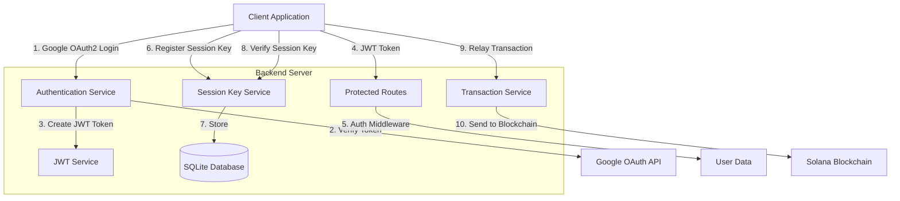

# Solana Session Key Management Backend

This backend server provides OAuth2 authentication with Google and Solana session key management services.



## Features

- **OAuth2 Authentication with Google**: Secure user authentication using Google Sign-In
- **JWT Token-based Authorization**: Stateless authorization using JSON Web Tokens
- **Solana Session Key Management**: Register, verify, and revoke Solana session keys
- **Transaction Relay**: Relay transactions to the Solana blockchain using session keys
- **API Documentation**: Swagger UI for API exploration and testing

## Architecture

The backend follows a modular architecture with clear separation of concerns:

- **Controllers**: Handle HTTP requests and responses
- **Services**: Implement business logic
- **Models**: Manage data persistence and database operations
- **Middleware**: Provide cross-cutting functionality like authentication
- **Utils**: Contain utility functions for Solana interactions and other operations
- **Config**: Store application configuration

## Technologies

- **Node.js & Express**: Fast, unopinionated web framework
- **TypeScript**: Type-safe JavaScript
- **SQLite**: Lightweight relational database
- **@solana/web3.js & @project-serum/anchor**: Solana blockchain interaction
- **jsonwebtoken**: JWT token generation and verification
- **google-auth-library**: Google OAuth2 authentication
- **Swagger**: API documentation

## Setup

### Prerequisites

- Node.js (v16+)
- npm or yarn
- Google Cloud Console project with OAuth credentials

### Installation

1. Clone the repository
2. Install dependencies:
   ```
   npm install
   ```
3. Configure environment variables:
   ```
   cp .env.example .env
   ```
   Update the `.env` file with your configuration:
   ```
   GOOGLE_CLIENT_ID=your-google-client-id
   GOOGLE_CLIENT_SECRET=your-google-client-secret
   GOOGLE_CALLBACK_URL=http://localhost:3000/auth/google/callback
   JWT_SECRET=your-jwt-secret
   ```
4. Build the application:
   ```
   npm run build
   ```
5. Start the server:
   ```
   npm start
   ```

## Development

Start the development server with hot reloading:
```
npm run dev
```

Run tests:
```
npm test
```

## API Endpoints

### Authentication

- `POST /auth/google`: Authenticate with Google token
- `GET /auth/me`: Get current user information (protected)

### Session Key Management

- `POST /api/session/register`: Register a new session key
- `POST /api/session/verify`: Verify a session key signature
- `POST /api/session/revoke`: Revoke a session key

### Transaction Management

- `POST /api/transaction/relay`: Relay a transaction using a session key

## Documentation

API documentation is available at `/api-docs` when the server is running.

## Security Considerations

- JWT tokens expire after 24 hours
- Session keys can be revoked manually or automatically expire based on configuration
- CORS is configured to restrict access to approved origins
- All sensitive operations are authenticated and authorized
- Solana transaction signing follows best practices

## License

MIT License

## Contributing

1. Fork the repository
2. Create your feature branch: `git checkout -b feature/my-feature`
3. Commit your changes: `git commit -am 'Add my feature'`
4. Push to the branch: `git push origin feature/my-feature`
5. Submit a pull request 