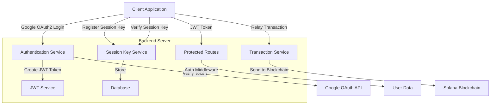

# Solana Session Key Management Backend

This backend server provides OAuth2 authentication with Google and Solana session key management services.



## Features

- **OAuth2 Authentication**: Secure user authentication using OAuth2 provider like Google
- **JWT Token-based Authorization**: Stateless authorization using JSON Web Tokens
- **Solana Session Key Management**: Register, verify, and revoke Solana session keys
- **Transaction Relay**: Relay transactions to the Solana blockchain using session keys

## Setup

### Prerequisites

- Node.js (v16+)
- npm or yarn
- Google Cloud Console project with OAuth credentials

### Installation

1. Clone the repository
2. Install dependencies:
   ```
   npm install
   ```
3. Configure environment variables:
   ```
   cp .env.example .env
   ```
   Update the `.env` file with your configuration:
   ```
   GOOGLE_CLIENT_ID=your-google-client-id
   GOOGLE_CLIENT_SECRET=your-google-client-secret
   GOOGLE_CALLBACK_URL=http://localhost:3000/auth/google/callback
   JWT_SECRET=your-jwt-secret
   ```
4. Build the application:
   ```
   npm run build
   ```
5. Start the server:
   ```
   npm start
   ```

## Development

Start the development server with hot reloading:
```
npm run dev
```

Run tests:
```
npm test
```

## API Endpoints

### Authentication

- `POST /auth/google`: Authenticate with Google token
- `GET /auth/me`: Get current user information (protected)

### Session Key Management

- `POST /api/session/register`: Register a new session key
- `POST /api/session/verify`: Verify a session key signature
- `POST /api/session/revoke`: Revoke a session key

### Transaction Management

- `POST /api/transaction/relay`: Relay a transaction using a session key

## Documentation

API documentation is available at `/api-docs` when the server is running.

## Security Considerations

- JWT tokens expire after 1 hours
- Session keys can be revoked manually or automatically expire based on configuration
- CORS is configured to restrict access to approved origins
- All sensitive operations are authenticated and authorized
- Solana transaction signing follows best practices

## Future Enhancements

The Session Key Management server can be extended to handle different configurations for each client, including:

- **Customizable Expense Limits**: Set maximum transaction amounts per session key
- **Flexible Expiry Times**: Configure different session validity periods based on client requirements
- **Threshold-Based Authorization**: Implement transaction value thresholds that require manual signing for higher-value transactions

These enhancements would allow us to provide a seamless, signature-less experience for users while simultaneously accommodating the specific policy requirements of different client applications.
