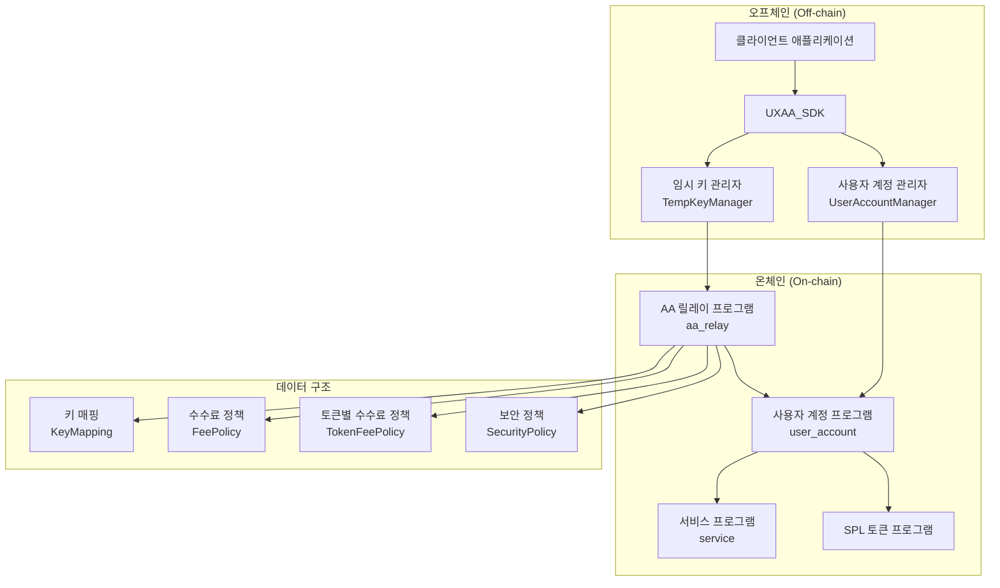
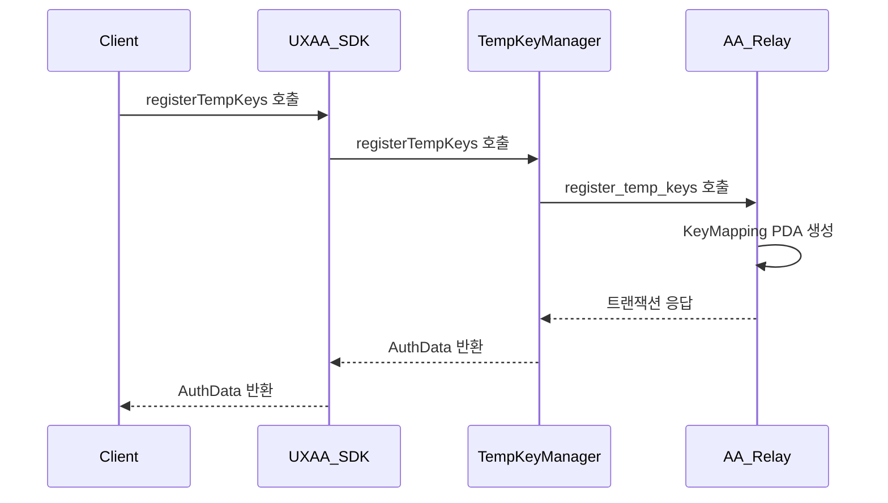
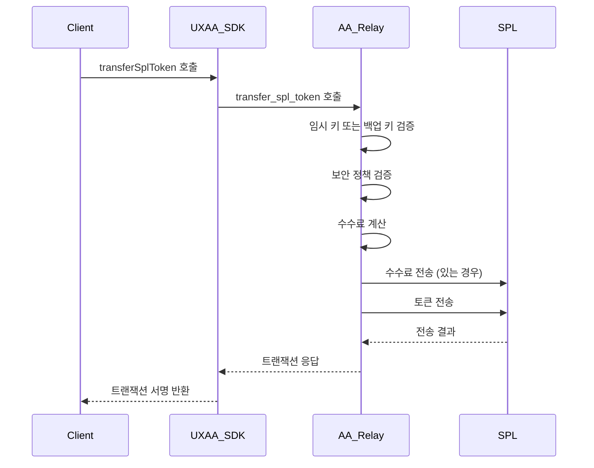
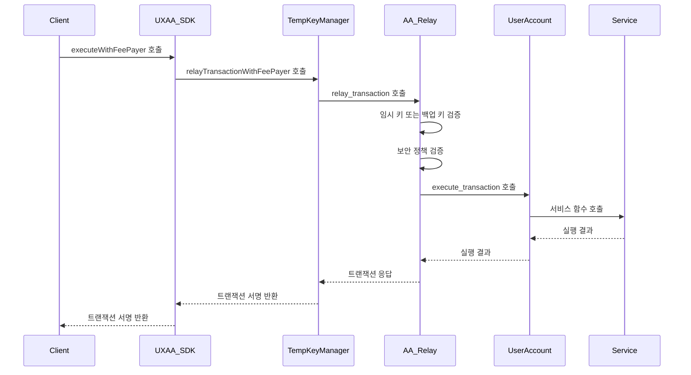

# UXAA(User eXperience Account Abstraction) 기술 문서

## 1. 개요

UXAA(User eXperience Account Abstraction)는 Solana 블록체인 기반의 "세션키(임시 키) + 계정 추상화(AA)" 시스템으로, 사용자 경험을 개선하고 보안을 강화하기 위한 포괄적인 솔루션입니다. 본 시스템은 사용자가 임시 키와 백업 키를 활용하여 지갑 팝업 없이 트랜잭션을 수행할 수 있도록 하며, 다양한 자산 관리 기능과 수수료 정책, 보안 정책을 제공합니다.

### 시스템 구성도



## 2. 핵심 컴포넌트

### 2.1 컨트랙트 (On-chain 프로그램)

#### 2.1.1 AA 릴레이 프로그램 (`aa_relay`)

AA 릴레이 프로그램은 임시 키와 백업 키를 관리하고, 트랜잭션을 중계하며, 수수료 및 보안 정책을 관리합니다.

**주요 함수:**
- `register_temp_keys`: 임시 키와 백업 키 등록
- `revoke_temp_key`: 임시 키 철회
- `change_backup_key`: 백업 키 변경
- `relay_transaction`: 트랜잭션 릴레이
- `transfer_spl_token`: SPL 토큰 전송
- `set_fee_policy`: 수수료 정책 설정
- `set_token_fee_policy`: 토큰별 수수료 정책 설정
- `set_security_policy`: 보안 정책 설정

**주요 데이터 구조:**
- `KeyMapping`: 임시 키와 백업 키 매핑 정보
  ```rust
  pub struct KeyMapping {
      pub temp_key: Pubkey,        // 임시 키
      pub backup_key: Pubkey,      // 백업 키 (영구적)
      pub user_id: String,         // 사용자 ID
      pub user_account_pda: Pubkey, // 사용자 계정 PDA
      pub expires_at: i64,         // 임시 키 만료 시간
      pub revoked: bool,           // 철회 여부
      pub created_at: i64,         // 생성 시간
  }
  ```

- `FeePolicy`: 기본 수수료 정책
  ```rust
  pub struct FeePolicy {
      pub fee_collector: Pubkey,   // 수수료 수금자
      pub sol_fee_bps: u16,        // SOL 수수료율 (basis points)
      pub token_fee_bps: u16,      // 토큰 수수료율 (basis points)
      pub min_fee_amount: u64,     // 최소 수수료 금액
      pub authority: Pubkey,       // 수수료 정책 관리자
  }
  ```

- `TokenFeePolicy`: 토큰별 수수료 정책
  ```rust
  pub struct TokenFeePolicy {
      pub token_mint: Pubkey,      // 토큰 Mint 주소
      pub fee_bps: u16,            // 해당 토큰의 수수료율
  }
  ```

- `SecurityPolicy`: 보안 정책
  ```rust
  pub struct SecurityPolicy {
      pub user_id: String,         // 사용자 ID
      pub max_tx_per_day: u32,     // 일일 최대 트랜잭션 수
      pub max_amount_per_tx: u64,  // 트랜잭션당 최대 금액
      pub max_amount_per_day: u64, // 일일 최대 금액
      pub daily_tx_count: u32,     // 현재 일일 트랜잭션 카운트
      pub daily_amount: u64,       // 현재 일일 누적 금액
      pub last_day: i64,           // 마지막 일자
      pub allowed_functions: Vec<u8>, // 허용된 함수 ID 목록
  }
  ```

#### 2.1.2 사용자 계정 프로그램 (`user_account`)

사용자 계정 프로그램은 사용자의 자산을 관리하고 트랜잭션을 실행합니다.

**주요 함수:**
- `initialize_user_account`: 사용자 계정 초기화
- `execute_transaction`: 트랜잭션 실행
- `add_token_balance`: 토큰 잔액 추가 (테스트용)
- `add_sol_balance`: SOL 잔액 추가 (테스트용)

**주요 데이터 구조:**
- `UserAccountData`: 사용자 계정 데이터
  ```rust
  pub struct UserAccountData {
      pub creator: Pubkey,         // 생성자
      pub user_id: String,         // 사용자 ID
      pub aa_relay_program: Pubkey, // AA 릴레이 프로그램
      pub created_at: i64,         // 생성 시간
      pub transaction_count: u64,  // 트랜잭션 수
      pub paused: bool,            // 일시 중지 여부
      pub sol_balance: u64,        // SOL 잔액
      pub tokens: Vec<TokenBalance>, // 토큰 잔액 목록
  }
  ```

#### 2.1.3 서비스 프로그램 (`service`)

서비스 프로그램은 비즈니스 로직을 처리하기 위한 예시 프로그램입니다.

### 2.2 SDK (Off-chain 컴포넌트)

#### 2.2.1 UXAA_SDK

SDK의 주요 진입점으로, 모든 기능에 접근할 수 있는 인터페이스를 제공합니다.

**주요 메소드:**
- `initializeUserAccount`: 사용자 계정 초기화
- `registerTempKeys`: 임시 키와 백업 키 등록
- `changeBackupKey`: 백업 키 변경
- `revokeTempKey`: 임시 키 철회
- `setFeePolicy`: 수수료 정책 설정
- `setTokenFeePolicy`: 토큰별 수수료 정책 설정
- `setSecurityPolicy`: 보안 정책 설정
- `transferSplToken`: SPL 토큰 전송
- `calculateFee`: 수수료 계산

#### 2.2.2 TempKeyManager

임시 키와 백업 키를 생성, 등록, 검증, 철회하는 기능을 제공합니다.

**주요 메소드:**
- `generateTempKeys`: 임시 키와 백업 키 생성
- `registerTempKeys`: 임시 키와 백업 키 등록
- `revokeTempKey`: 임시 키 철회
- `changeBackupKey`: 백업 키 변경
- `getTempKeys`: 등록된 임시 키 목록 조회
- `getAuthData`: 키 인증 데이터 조회
- `isKeyValid`: 키 유효성 확인

#### 2.2.3 UserAccountManager

사용자 계정을 관리하고 자산 관련 기능을 제공합니다.

**주요 메소드:**
- `initializeUserAccount`: 사용자 계정 초기화
- `addTokenBalance`: 토큰 잔액 추가 (테스트용)
- `addSolBalance`: SOL 잔액 추가 (테스트용)

## 3. 주요 프로세스 흐름

### 3.1 임시 키 및 백업 키 등록 프로세스



### 3.2 SPL 토큰 전송 프로세스



### 3.3 트랜잭션 릴레이 프로세스



## 4. 주요 기능 상세 설명

### 4.1 계정 추상화 시스템

UXAA의 계정 추상화 시스템은 세 가지 주요 컴포넌트로 구성됩니다:

1. **임시 키 관리**:
   - 사용자는 임시 키(Temporary Key)를 생성하고 등록하여 제한된 시간 동안 사용할 수 있습니다.
   - 임시 키는 만료 시간이 있어 보안성을 강화합니다.
   - `register_temp_keys` 함수로 등록하고 `revoke_temp_key` 함수로 철회할 수 있습니다.

2. **영구 백업 키**:
   - 임시 키와 함께 영구적인 백업 키(Backup Key)를 등록합니다.
   - 백업 키는 만료 시간이 없어 임시 키가 만료되거나 사용 불가능한 경우에도 계정에 접근할 수 있습니다.
   - `change_backup_key` 함수로 백업 키를 변경할 수 있으며, 변경은 현재 백업 키 소유자만 가능합니다.

3. **트랜잭션 릴레이**:
   - 임시 키나 백업 키로 서명된 트랜잭션을 AA 릴레이 프로그램이 검증하고 중계합니다.
   - `relay_transaction` 함수로 트랜잭션을 중계하며, 이 때 키의 유효성, 만료 여부, 그리고 보안 정책을 검증합니다.
   - 검증이 완료되면 사용자 계정 프로그램으로 CPI(Cross-Program Invocation)를 호출합니다.

### 4.2 SPL 토큰 지원

UXAA는 Solana의 SPL 토큰 표준을 완벽하게 지원합니다:

1. **SPL 토큰 전송**:
   - `transfer_spl_token` 함수로 SPL 토큰을 안전하게 전송할 수 있습니다.
   - 임시 키나 백업 키로 서명된 트랜잭션을 통해 토큰을 전송합니다.
   - 전송 시 수수료 정책에 따라 수수료가 자동으로 계산되고 적용됩니다.

2. **토큰 계정 자동 생성**:
   - SDK 레벨에서 토큰 전송 시 수신자의 토큰 계정이 존재하지 않으면 자동으로 생성합니다.
   - Associated Token Account(ATA) 표준을 준수합니다.

3. **토큰 잔액 관리**:
   - 사용자 계정 프로그램에서 토큰 잔액을 관리하고 조회할 수 있습니다.
   - 테스트 목적으로 `add_token_balance` 함수를 통해 토큰 잔액을 추가할 수 있습니다.

### 4.3 커스터마이징 가능한 수수료 정책

UXAA는 다양한 수수료 정책을 설정할 수 있는 유연한 시스템을 제공합니다:

1. **기본 수수료 설정**:
   - `set_fee_policy` 함수로 SOL 및 토큰 전송에 대한 기본 수수료율을 설정할 수 있습니다.
   - 수수료율은 basis points(bps) 단위로 설정되며, 10000bps = 100%입니다.
   - 최소 수수료 금액을 설정하여 소액 전송에도 최소한의 수수료를 보장할 수 있습니다.

2. **토큰별 수수료 정책**:
   - `set_token_fee_policy` 함수로 특정 토큰에 대해 다른 수수료율을 적용할 수 있습니다.
   - 토큰 Mint 주소를 기준으로 토큰별 수수료율을 설정합니다.

3. **수수료 계산 및 적용**:
   - `calculateFee` 함수로 전송 전에 수수료를 미리 계산할 수 있습니다.
   - 전송 시 수수료가 자동으로 계산되고 적용되며, 수수료 수금자에게 전송됩니다.
   - 원본 금액, 수수료, 수신자 수령액에 대한 정보를 제공합니다.

### 4.4 보안 정책 커스터마이징

보안 정책을 통해 계정 사용에 대한 제한을 설정할 수 있습니다:

1. **일일 트랜잭션 제한**:
   - `set_security_policy` 함수로 사용자별 일일 최대 트랜잭션 수를 제한할 수 있습니다.
   - 일일 트랜잭션 카운트가 자동으로 추적되며, 일자가 바뀌면 초기화됩니다.

2. **트랜잭션 금액 제한**:
   - 트랜잭션당 최대 금액과 일일 총 금액에 대한 제한을 설정할 수 있습니다.
   - 이를 통해 대규모 자금 유출을 방지할 수 있습니다.

3. **함수 접근 제어**:
   - 허용된 함수 ID 목록을 통해 특정 함수에 대한 접근을 제한할 수 있습니다.
   - 허용되지 않은 함수 호출은 거부됩니다.

4. **자동 정책 갱신**:
   - 일일 제한은 Unix 타임스탬프를 기준으로 자동으로 초기화됩니다.
   - 일자가 바뀌면 일일 트랜잭션 카운트와 누적 금액이 0으로 초기화됩니다.

## 5. PDA 구조 및 계정 관리

### 5.1 키 매핑 PDA

임시 키와 백업 키를 사용자 계정 PDA에 매핑합니다:

```
seeds = [b"key_mapping", temp_key.as_ref()]
```

이 PDA는 다음 정보를 저장합니다:
- 임시 키 (temp_key)
- 백업 키 (backup_key)
- 사용자 ID (user_id)
- 사용자 계정 PDA (user_account_pda)
- 임시 키 만료 시간 (expires_at)
- 철회 여부 (revoked)
- 생성 시간 (created_at)

### 5.2 수수료 정책 PDA

기본 수수료 정책을 저장합니다:

```
seeds = [b"fee_policy"]
```

이 PDA는 다음 정보를 저장합니다:
- 수수료 수금자 (fee_collector)
- SOL 수수료율 (sol_fee_bps)
- 토큰 수수료율 (token_fee_bps)
- 최소 수수료 금액 (min_fee_amount)
- 수수료 정책 관리자 (authority)

### 5.3 토큰별 수수료 정책 PDA

토큰별 수수료 정책을 저장합니다:

```
seeds = [b"token_fee_policy", token_mint.key().as_ref()]
```

이 PDA는 다음 정보를 저장합니다:
- 토큰 Mint 주소 (token_mint)
- 수수료율 (fee_bps)

### 5.4 보안 정책 PDA

사용자별 보안 정책을 저장합니다:

```
seeds = [b"security_policy", user_id.as_bytes()]
```

이 PDA는 다음 정보를 저장합니다:
- 사용자 ID (user_id)
- 일일 최대 트랜잭션 수 (max_tx_per_day)
- 트랜잭션당 최대 금액 (max_amount_per_tx)
- 일일 최대 금액 (max_amount_per_day)
- 현재 일일 트랜잭션 카운트 (daily_tx_count)
- 현재 일일 누적 금액 (daily_amount)
- 마지막 일자 (last_day)
- 허용된 함수 ID 목록 (allowed_functions)

### 5.5 사용자 계정 PDA

사용자 계정 정보를 저장합니다:

```
seeds = [b"user_account", user_id.as_bytes()]
```

이 PDA는 사용자 계정 프로그램에서 관리하며, 다음 정보를 저장합니다:
- 생성자 (creator)
- 사용자 ID (user_id)
- AA 릴레이 프로그램 (aa_relay_program)
- 생성 시간 (created_at)
- 트랜잭션 수 (transaction_count)
- 일시 중지 여부 (paused)
- SOL 잔액 (sol_balance)
- 토큰 잔액 목록 (tokens)

## 6. 설치 및 사용 방법

### 6.1 요구 사항
- Solana CLI
- Node.js와 NPM/Yarn
- Anchor Framework

### 6.2 설치
```bash
# 저장소 클론
git clone https://github.com/your-username/uxaa.git
cd uxaa

# 의존성 설치
yarn install

# 프로그램 빌드
anchor build
```

### 6.3 배포
```bash
# 프로그램 배포 (devnet)
anchor deploy --provider.cluster devnet
```

### 6.4 예제 실행
```bash
# 수수료 및 SPL 토큰 예제 실행
ts-node app/examples/fee-example.ts
```

## 7. 결론

UXAA(User eXperience Account Abstraction)는 Solana 블록체인에서 사용자 경험을 크게 향상시키는 계정 추상화 솔루션입니다. 임시 키와 영구 백업 키, SPL 토큰 지원, 커스터마이징 가능한 수수료 정책, 강력한 보안 정책을 통해 사용자 친화적이고 안전한 블록체인 상호작용을 가능하게 합니다.
